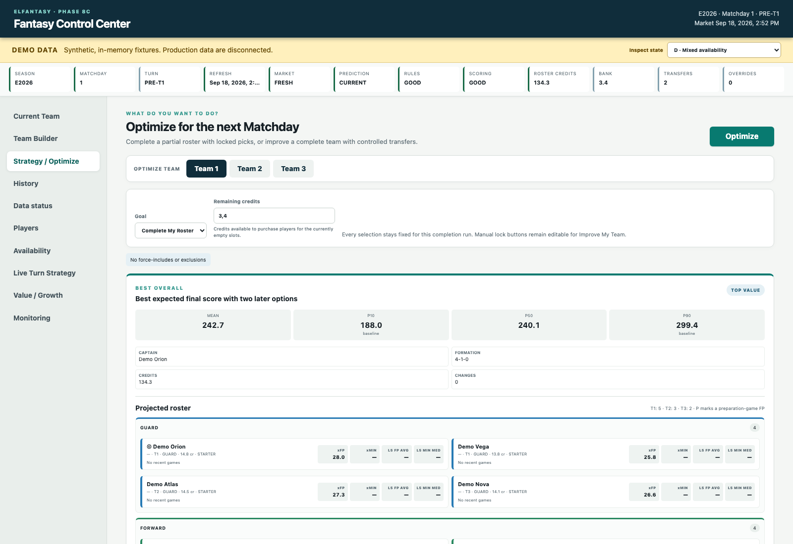

# EuroLeague Fantasy Control Center

A local data, prediction, and decision-support application for EuroLeague Fantasy Challenge.

The project helps a Fantasy manager decide which players to own, which five to start, who to use as sixth man and captain, and whether to change the lineup after an early Turn. It combines official EuroLeague results, current Fantasy prices, upcoming games, player availability, historical performance, and the manager's existing roster in one browser-based control center.

For every upcoming game, the application estimates a player's minutes and a full range of possible Fantasy-point outcomes rather than relying only on season averages. It then searches for legal rosters and roles under the real budget, position, team, transfer, captain, sixth-man, and Turn rules. The same data also powers sortable player history, round analysis, live scores, price tracking, and model monitoring across three independently saved Fantasy teams.

> This is an independent research project. It is not an official EuroLeague or EuroLeague Fantasy product.



## Highlights

- **Live Matchday refresh** — updates schedules, completed games, box scores, Fantasy prices, teams, opponents, and availability evidence.
- **Probabilistic player forecasts** — expected minutes, expected Fantasy points, P10/P25/P50/P75/P90/P95 outcomes, and upside/downside probabilities.
- **Legal roster optimization** — enforces 4 guards, 4 forwards, 2 centers, one coach, the credit limit, team limits, transfer limits, starting formations, captain, and sixth man.
- **Turn-aware strategy** — preserves later-Turn bench options before the round and evaluates legal field, bench, and captain changes after a Turn finishes.
- **Three independent teams** — Team 1, Team 2, and Team 3 keep separate rosters, bank credits, transfers, and strategy state.
- **Availability scenarios** — combines source status with explicit PLAY, OUT, UNKNOWN, or LIMITED decisions.
- **Player and round history** — sortable tables for FP, minutes, box-score components, credits, and credit movement.
- **Local and reproducible** — the application runs on localhost, uses a local DuckDB database, and keeps frozen production model artifacts read-only.
- **Safe demo mode** — explores the complete interface with synthetic in-memory data and does not touch live or production data.

## How it works

| Stage | What happens | Result |
|---|---|---|
| **1. Collect** | Official EuroLeague data, the current Fantasy market, prices, schedules, and availability evidence are updated incrementally. | Timestamped source records |
| **2. Store** | Raw and normalized point-in-time data are written to DuckDB with source provenance. | Reproducible historical snapshots |
| **3. Predict** | Leakage-safe pre-game features are passed through frozen, chronologically validated models. | Expected minutes, expected FP, quantiles, and upside/downside probabilities |
| **4. Select** | Forecasts, the current roster, available credits, and Fantasy rules enter the optimization and simulation engines. | Legal roster, formation, captain, sixth-man, and Turn choices |
| **5. Explain** | Recommendations, uncertainty, live results, history, and data freshness are shown in the local Control Center. | Decisions that can be reviewed before acting |

The data flow is:

**EuroLeague and Fantasy sources → DuckDB snapshots → pre-game features → player forecasts → rules-based optimization and Monte Carlo simulation → Control Center recommendations**

The pipeline deliberately separates four concerns:

1. **Source capture and normalization** preserve source timestamps, identities, and raw provenance.
2. **Prediction** estimates outcomes using only information available before tip-off.
3. **Optimization** applies Fantasy rules to complete, improve, or build a team.
4. **Presentation** explains the inputs, recommendations, uncertainty, and live Turn actions in the local web UI.

The central player forecast remains the frozen Phase 6C model. Phase 7 supplies the rules engine, exact mixed-integer roster solver, simulations, and between-Turn recourse. Later research remains isolated unless it beats the frozen production model through chronological validation.

### How the AI selection works

The “AI” is a combination of predictive machine learning, mathematical optimization, and simulation:

1. **Forecast each player.** The frozen models use only information known before the game, including historical minutes, Fantasy production, usage and offensive involvement, opponent context, venue, and resolved availability. They estimate expected FP plus P10–P95 outcomes and high-score probabilities. Forecasts are conditional on the player taking part; uncertain availability remains visible instead of being silently guessed.
2. **Generate legal teams.** An exact mixed-integer solver considers the eligible market and chooses players, coach, starters, sixth man, captain, and formation while enforcing credits, positions, club limits, transfers, locks, and exclusions.
3. **Test uncertainty.** Monte Carlo simulations draw many plausible player and coach outcomes from the forecast distributions. The strategy engine compares candidate lineups by expected final score, floor, upside, and the value of legal changes between Turns.
4. **Present usable choices.** The UI returns **Best Overall**, **Safer**, and **Higher-Upside** options with complete rosters, projected scores, credit use, transfers, Turn balance, and later-Turn replacement paths. After a Turn, actual FP replace projections for completed games and only legal remaining actions are evaluated.

The selection process is deterministic and reproducible for the same data, model artifacts, constraints, and simulation seed. Model and strategy fingerprints are stored with each recommendation so results can be audited later.

## Technology

- Python 3.13
- DuckDB
- pandas, NumPy, SciPy
- scikit-learn, CatBoost, XGBoost, LightGBM
- Playwright for the user-controlled Fantasy login flow
- Dependency-free Python HTTP server
- Vanilla HTML, CSS, and JavaScript UI

## Quick start

### Requirements

- Python 3.13
- Git
- Chrome, or Playwright Chromium, for authenticated Fantasy access
- macOS or Linux shell commands in the examples below

### 1. Create the environment

From the repository root:

```bash
python3.13 -m venv .venv
source .venv/bin/activate
python -m pip install --upgrade pip
```

Install all required Python libraries automatically from the tracked requirements file:

```bash
python -m pip install -r requirements.txt
```

Activation is optional. You can replace `python` in every command with `.venv/bin/python`. Re-run the requirements command after pulling changes that update `requirements.txt`.

### 2. Try the UI safely

Demo mode is the fastest way to inspect the project after cloning:

```bash
python -m scripts.control_center --demo
```

The browser should open automatically at [http://127.0.0.1:8765](http://127.0.0.1:8765). Demo data are synthetic and exist only in memory.

To inspect a particular UI state:

```bash
python -m scripts.control_center --demo --demo-state captain-decision
```

Run the following command to list every available demo state:

```bash
python -m scripts.control_center --help
```

### 3. Initialize the local database

Live and historical workflows use an ignored local database at `data/db/euroleague.duckdb`:

```bash
python -m scripts.init_database
```

The database, raw downloads, browser login state, and other private or reproducible runtime files are intentionally excluded from Git.

### 4. Authenticate with EuroLeague Fantasy

Live Fantasy routes require a user-controlled authenticated browser session:

```bash
python -m scripts.login_fantasy
```

A visible browser opens on the official Fantasy site. Log in there, then open **My Team** or the player market. The script never asks for or prints the username, password, or returned token. It stores the reusable browser state in `.auth/euroleague.json`, which is ignored by Git and written with private permissions.

If Chrome is unavailable, install Playwright Chromium and select it:

```bash
python -m playwright install chromium
python -m scripts.login_fantasy --channel bundled-chromium
```

### 5. Refresh data

The UI button **Update latest data** runs the normal refresh workflow. The same workflow can be run from the terminal:

```bash
python -m scripts.update_live
```

A refresh may finish as `PARTIAL` when an optional source is unavailable. Last valid values remain visible and are marked with their freshness status.

### 6. Start the live Control Center

```bash
python -m scripts.control_center
```

Useful options:

```bash
python -m scripts.control_center \
  --host 127.0.0.1 \
  --port 8765 \
  --profile default \
  --no-browser
```

Only one process should open the same DuckDB file at a time. Stop the server with **Ctrl-C**.

## Using the UI

### Current Team

Create and maintain up to three saved Fantasy teams. Each roster validates:

- 4 guards
- 4 forwards
- 2 centers
- 1 coach
- budget and bank credits
- maximum players from one club
- manual locks and exclusions

From this screen you can analyze the roster, complete missing positions, or improve a complete team.

### Team Builder

Build a team manually in any order. Filter by position, price range, team, name, and Turn, then save a partial draft or send it to AI completion.

### Strategy / Optimize

Choose one of three workflows:

| Goal | Behavior |
|---|---|
| **Complete My Roster** | Preserves every selected entity and fills only empty positions. |
| **Improve My Team** | Uses the current roster, bank, transfer allowance, and locks to recommend controlled changes. |
| **Build a new team** | Builds a full legal roster from a supplied total budget. |

The optimizer returns Best Overall, Safer, and Higher-Upside strategies. Each card shows the entire projected roster, Turn counts, roles, captain, formation, credit accounting, transfers, score distribution, and legal later-Turn replacement options.

When a slate has multiple Turns, pre-round recommendations keep at least one usable later-Turn player on the ordinary bench so a poor early score can be replaced. The fixed sixth man is handled separately.

### Live Turn Strategy

After a Turn is complete, select **Update Turn Results / Re-evaluate Strategy**. The app:

1. refreshes completed games and official box scores;
2. displays realized FP and minutes for players who have played;
3. locks completed-Turn players against illegal promotion;
4. compares KEEP and SWITCH outcomes for the full team;
5. recommends legal formation and captain actions for players who have not played.

If no immutable pre-lock role snapshot matches a saved roster, the fallback uses the saved roster and official Turn assignments. Such suggestions are clearly marked as conditional because the original starter, bench, sixth-man, and captain roles cannot be reconstructed safely.

### Players

Explore the upcoming slate using sortable views for:

- expected FP
- expected minutes
- FP per credit
- upside and downside
- distribution percentiles
- recent FP and minute form
- availability
- Turn and opponent
- credit-growth diagnostics

Wide tables keep column headers visible while scrolling down and player names visible while scrolling horizontally.

### Availability

Review source status and add a manual PLAY, OUT, UNKNOWN, or LIMITED decision. Source history remains immutable; an override changes only the resolved decision used downstream.

### History

Browse seasons, games, players, teams, and preparation games. The player table supports:

- **All Rounds:** per-game averages, starting/latest credits, and cumulative credit change.
- **One Round:** actual FP, minutes, points, rebounds, assists, steals, blocks, PIR, shooting, free throws, turnovers, personal fouls, fouls won, and round credit movement.

### Value / Growth

Shows secondary price intelligence for players who remain competitive on current Fantasy value. Price forecasts never replace expected Fantasy points as the primary optimization objective.

### Data status and Monitoring

Data status exposes Matchday resolution, market and prediction fingerprints, compatibility gates, freshness, and refresh changes. Monitoring presents read-only model, strategy, availability, data-quality, and price diagnostics. Monitoring never retrains a model or silently changes a recommendation.

## Common commands

```bash
# Initialize or migrate DuckDB
python -m scripts.init_database

# Update current season, market, availability, and recent completed games
python -m scripts.update_live

# Generate live predictions from stored state
python -m scripts.predict_live --no-refresh

# Generate live predictions and refresh first
python -m scripts.predict_live --refresh

# Run the optimizer directly
python -m scripts.optimize_fantasy --season E2026 --matchday 2 --budget 100

# Validate the canonical database
python -m scripts.check_database

# Run the Control Center regression suite
python -m unittest tests.test_phase8a
```

For research and backfill commands, see [the technical reference](docs/technical-reference.md).

## Repository structure

```text
ELfantasy/
├── scripts/                    # CLI entry points
├── src/
│   ├── control_center/         # HTTP service, repositories, recommendations
│   ├── data/                   # source clients, normalization, identity mapping
│   ├── db/                     # DuckDB schema, migrations, ingestion, integrity
│   ├── live/                   # refresh, features, availability, prediction
│   ├── modeling/               # research and predictive model utilities
│   └── strategy/               # Fantasy rules, optimization, simulation
├── web/control_center/         # browser UI
├── tests/                      # unit, integration, regression, integrity tests
├── notebooks/                  # research notebooks
├── reports/                    # design, audits, validation, experiment reports
├── data/
│   ├── reference/              # versioned rules and reviewed aliases
│   ├── samples/                # retained sanitized samples
│   ├── raw/                    # ignored source responses
│   ├── db/                     # ignored local DuckDB database
│   └── derived/                # generated/frozen analytical artifacts
├── docs/technical-reference.md # detailed phase-by-phase project record
├── requirements.txt
└── README.md
```

## Data and model principles

- **Point-in-time inputs:** future data and target-game outcomes are excluded from pregame features.
- **Chronological validation:** models are compared on forward-only season folds.
- **Fail-closed decisions:** ambiguous Matchdays, incompatible rules, missing mappings, and unresolved availability remain visible rather than being guessed.
- **Immutable evidence:** source snapshots, model manifests, recommendation inputs, and strategy snapshots carry fingerprints.
- **Conditional predictions:** player performance distributions are conditional on playing; the app does not invent injury probabilities.
- **Frozen production layers:** research challengers do not replace a production model unless they pass the documented validation gate.

## Troubleshooting

### Address already in use

Another Control Center process is using port 8765:

```bash
lsof -nP -iTCP:8765 -sTCP:LISTEN
kill <PID>
```

You can also select another port:

```bash
python -m scripts.control_center --port 8766
```

### DuckDB lock conflict

Only one process should hold `data/db/euroleague.duckdb`. Stop the older Control Center or Python process before starting another one:

```bash
lsof data/db/euroleague.duckdb
kill <PID>
```

### `MATCHDAY_AMBIGUOUS`

The Fantasy market could not be matched uniquely to the official upcoming schedule. Refresh after the next market is published. The application blocks optimization instead of assigning games or Turns speculatively.

### Missing or stale games

Use **Update latest data** or run `python -m scripts.update_live`. History and recent-form views read completed canonical box scores and update after the official result is available.

### Authentication expired

Run `python -m scripts.login_fantasy` again. The previous private session file is replaced only after a new login is verified.

## Research documentation

- [Technical phase-by-phase reference](docs/technical-reference.md)
- [Database architecture](reports/database_architecture.md)
- [Data audit](reports/data_audit.md)
- [Live prediction protocol](reports/phase6a_prospective_prediction_protocol.md)
- [Phase 7 strategy engine](reports/phase7_dynamic_strategy_engine.md)
- [Phase 9A stat-line challenger](reports/phase9a_statline_game_environment.md)

## Privacy and generated files

The following stay local through `.gitignore`:

- `.auth/` browser storage and session material
- `.env` files
- `data/db/` DuckDB databases and WAL files
- `data/raw/` full source responses
- `data/predictions/` per-run live prediction exports
- `data/benchmarks/` local human-comparison exports
- most reproducible generated artifacts
- virtual environments and IDE files
